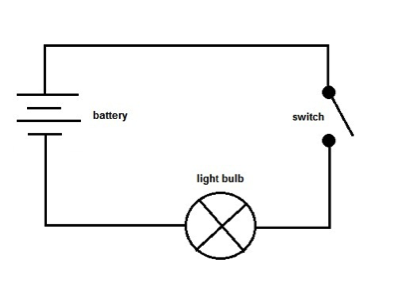
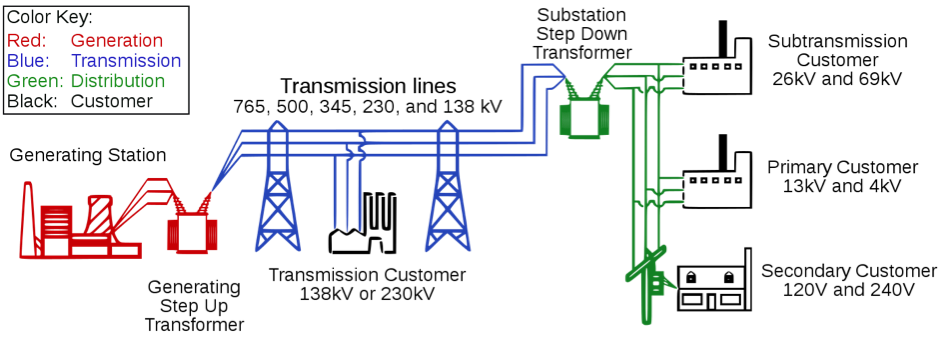
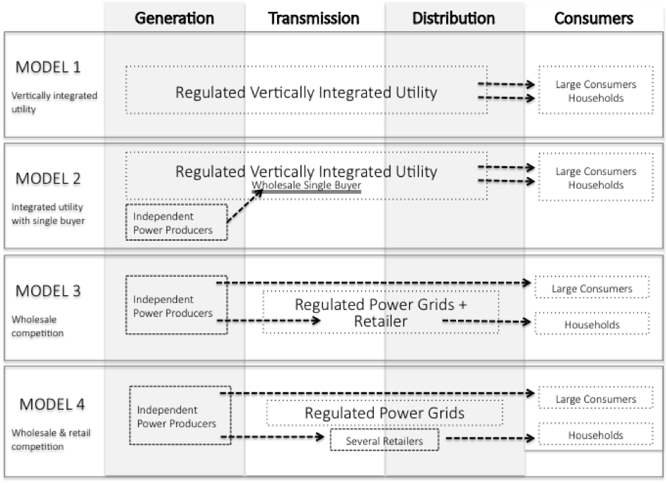

**********************************
Overview of electric power systems
**********************************

=======================================
 1.	Electricity: basic terminology
=======================================

Electricity is the movement of electrons along electrical conductors (wires) that form a closed circuit. In itself, electricity is not that useful, but it is valuable as a source of energy. It is also easier and more convenient to transport electricity over long distances and it is readily convertible into other forms of energy like heat, light and mechanical energy.

**Measuring electricity.** Since electricity is a form of energy like heat, it can be measured and ex-pressed in similar terms. The conventional unit of measuring any type of energy is joule (J). Related to this, is the concept of power, which is the rate at which energy is delivered. Mathematically power is equal to the quantum of energy delivered divided by the time in which it was delivered.  Power is measured in watts (W), where one watt is equal to one joule of energy delivered in one second.

.. math::
    \begin{split} 
		energy &= power \times time 
	\end{split}

In practice, electrical energy or electricity is often not expressed in joules but rather by referring to power. Conventionally electricity is measured in Watt-hours (Wh) with one watt-hour being equal to the amount of energy delivered in one second. But one Wh is an extremely small quantum of energy in practical applications. More useful units are kilowatt-hours (1 kWh = 1000 Wh) or megawatt-hours (1 MWh = 1000 kWh). Very high quantum of electricity is measured in gigawatt-hours (1 GWh = 1000 MWh) and terawatt-hours (1 TWh = 1000 GWh).

=======================      =======
Appliance	                   Wattage
=======================      =======
Laptop computer	             25 W
LCD Television	             150 W
Dishwasher	                 330 W
Clothes Dryer	               2780 W
Large solar power plant	     750 MW
Large coal power plant		   4 GW
Peak load in Germany	       100 GW
=======================      =======

**Power, voltage and current.** Electricity flows through electrical circuits, usually conductors (wires) made of copper or aluminum. A simple electrical circuit would like one shown in :ref:`my-figure1` in which a light bulb is connected to a source of electricity through wires. The symbols used in that figure are standardized  `electric symbols <https://en.wikipedia.org/wiki/Electronic_symbol>`_.

.. _my-figure1:

    A simple electrical circuit

    Key point: Key ideas used when describing electrical circuits are voltage, current and power.
    Source: `Physics Stack exchange <https://physics.stackexchange.com/questions/178009/how-does-electric-energy-flow-in-a-circuit)>`_

**Calculating energy consumption.** The rate at which the bulb consumes electrical energy in such a circuit can be calculated if the know the voltage drop across the bulb and the electrical current flow-ing through the wires. In general, the rate at which an element in a circuit is consuming energy (measured in J) is equal to voltage drop across the element (measured in volts, V) times the electric current (I) flowing through it (measured in amperes, A). More precisely: if the voltage drop across the bulb is a hundred volts (100 V) and the current flowing through the light bulb is one ampere (1 Amp), then the rate at which the bulb consumes electrical energy is equal to 100 W.

*Q: What is the amount of electrical energy consumed by a 100 W bulb described in the circuit above in one hour?*

*A: The amount of energy consumed in one hour is equal to the rate at which energy delivered times the amount of time for which it is delivered. Energy consumed by the light bulb in one hour is equal 100 W (J/s) X 1 h (3600 s) or 3600 J.*

**Energy loss in electrical circuits.** When electricity flows through a substance, including electric wires and cables, some of it is lost (in the form of heat) due to the “resistance” offered by the sub-stance. Think about electric current as water flowing through a pipe and resistance as the friction offered by the pipe to the flowing water. Resistance offered by a conductor is measured in Ohms (Ω). Mathematically, the energy loss is proportional to square of the current flow. In other words, my cut-ting the current flow in half the loss can be reduced by 75%. We saw earlier that, for a given power, voltage is inversely proportional to current (power is equal to voltage times current, so for the same value of power current is equal to power divided by voltage). This implies that electrical energy lost in a circuit is inversely proportional to the square of voltage and the resistance offered by the conductor.

.. math::
	\begin{split} 
		Energy \ lost &= current^2 \times resistance &= \frac {voltage^2} {resistance}
	\end{split} 

For a given amount of power, raising the voltage by a factor of 10 reduces the current by a corresponding factor of 10 and therefore the losses by a factor of 100, provided the same sized conductors are used in both cases.

We said earlier that electrical energy is more useful than other forms of energy because it can be transported over long distances quite easily. But this is true only when electricity is transmitted across wires at high voltage; at lower voltages energy loss would be substantial and it would not be economical to transfer energy over long distances.

**High vs. low voltage.** The benefit of reduced thermal losses at high voltages comes at a cost: safety. High voltages are dangerous to operate – you should keep a distance of 4m to a conductor loaded with 400 kV. Such safety measures are both impractical and costly for handling electricity at home. An optimal solution is to have an electricity system that transmits electricity over long-distances at high voltages while providing connecting end-consumers to the system at low voltages. This is accomplished using “power transformers”.

**AC vs. DC power.** The first power systems developed in the late 19th century provided electricity at a constant voltage: these are known as direct current or DC systems. Later these systems gave way to alternating current or AC systems that were based on a voltage that varies in a constant, regular way. The rate at which AC voltage varies is known as frequency and is expressed in hertz (Hz). Most power systems in the world operate at either 50 Hz or 60 Hz. The frequency of current has to be maintained at a constant level throughout the electrical system as large deviations from the frequency, at which electrical appliances and systems are designed to operate, can damage them. AC systems are widely used because through a device called transformer the voltage within an AC system can be easily in-creased or decreased. By contrast, it is more complicated to “step up” (increase) or “step down” (decrease) the voltage of DC current. This is the reason that AC systems outcompeted DC ones in the 20th century, using transformers electricity voltage can be stepped up to allow transmission at high voltages to reduce energy loss, and voltage can be reduced at the consumption point for safe use.

============================================
2. Physical setup of electric power systems
============================================

**Electric power systems.** A complex network of interconnected electrical equipment and circuits is deployed to enable supply and use electricity and makes up the electric power system. The overall working of the system can be simplified as follows: electricity is produced at large power plants, transmitted over long distances over the transmission system and brought to the consumers through the distribution system. :ref:`my-figure2` provides a schematic view of such an electrical system. Historically, such a system emerged, as it was economical to build big power plants near the source of energy (coalmines, rivers etc.) and use transmission and distribution system to transfer the electricity produced to consumers.

.. _my-figure2:

    Schematic view of a classical electric power system

    Source: `Wikipedia <https://en.wikipedia.org/wiki/Electric_power_transmission>`_
    Key point: An electrical system is divided into generation, transmission and distribution functions.

**Generation.** Power plants are the production centers of electrical systems. A big power plant usually consists of several smaller generating units, each of which consists of two basic components: a turbine that produces rotary motion and a generator that converts this mechanical energy of rotation into electrical energy. Different technologies and energy sources can produce this rotation motion. In a thermal power plant pressurized steam fuels this motion that is produced by heating water through combustion of coal or biomass, or nuclear fission, or solar heat. In certain natural gas based thermal plants the pressure of hot gasses produced during combustion drives the rotor (these “gas turbines” work just like jet engines of aircrafts). In wind or hydro power plants, the pressure of wind or water against the rotor moves it. The one exception is the solar photovoltaic (PV) generation technology, which is distinctly different from the traditional generators as it directly converts light energy to electricity, without using a turbine or a generator.

Each generating unit in a power plant has an installed or nameplate capacity, which is its maximum mega-watt (MW) electrical power capacity that the unit can generate. Corresponding to this generation capacity is the actual electrical generation, which is measured in megawatt hour (MWh). One MWh is equal to the amount of electricity generated by a generating unit with a capacity of one mega-watt running continuously for one hour.

.. math::
	\begin{split} 
		Electrical \ generation \ (G) &= capacity \ (C)  \times time
	\end{split} 

Where G is generation in mega-watt hours (MWh), C is capacity in mega-watt (MW) and time is hours for which the generating unit is run. Note that, because the year has 8760 hours, a one mega-watt generating unit can generate a maximum of 8760 MWh of electricity during a year. Practically, actual electrical generation from a unit is lower than its installed capacity and is measured by electrical meters. Power stations are in more detailed described in Power plants.

**Transmission.** Transmission and distribution systems are the means of transferring electricity from power stations to load (consumption) centers. They differ however in the voltage levels of operation, with transmission typically being above 220 kV (the exact voltage of demarcation differs by country and systems); the voltages are very high to reduce the energy loss in long distance transmission of electricity. The transmission system consists of transmission lines, sub-stations and system services. The system is like a mesh spread over hundreds of kilometers and is commonly referred to as the transmission grid or network. Flow of electricity through the transmission grid can be stylized as follows: electricity is fed into the grid at power plants; electricity flows towards consumption (load) centers; sub-stations near the load centers “step down” the voltage and feed power into the distribution system to be delivered to consumers. But the stylized picture is overly simplistic because:

* there are many power plants in the system
* there are usually many “paths” from a given power plant to the load centers (because of the meshed structure of the grid)
* laws of physics govern flow of electricity and not contracts between power plants and consumers

These complications will be discussed in detail in Chapter Power grids. One important system service is balancing energy, which will be discussed in Chapter Balancing.

This makes managing flow of electricity across the transmission grid a complex task. The transmission grid is like a highway network crisscrossing a country. There is more than one route between two points and traffic is flowing on all routes. If for some reason one road is blocked, there is a jam till the order is restored. Traffic flows on alternative routes that get more crowded (overloading of transmission lines) and these alternative routes may develop jams as well. Thus a problem in the network can spread and cause breakdown of the entire system. Because electrons flowing through the transmission lines travel at much higher speeds than cars, breakdowns can occur in a matter of seconds. Transmission systems need to be built and managed to handle such eventualities to ensure continuous flow of electricity to consumers.

**Distribution.** The distribution system consists of electric lines, substations and cables reaching all the way to the consumers. Distribution has two distinct functional components – distribution and supply. “Distribution” refers to the physical network through which electricity is transferred from the transmission system to end consumers. “Supply” refers to the commercial activities related to selling power to consumers.
The institutional relationship between generation, transmission and distribution systems is deter-mined by the market structure of the electricity industry. The legal system also puts restrictions on ownership of the different functions – supply and distribution are jointly operated as a single function in many areas, while that might not be the case in other locations.

============================================
3.	Market structure of electricity industry
============================================

The way the electricity industry is organized varies across the world and has changed significantly over the last century. To see the differences, it makes helpful to think about the industry in terms of different components of the electricity value chain: generation, transmission, distribution, and retail supply. Depending upon the industry structure, these functions can be either performed by one firm or by separate firms, working under competition or as regulated monopolies.

**Vertically integrated electricity utilities.** Until the 1990s electricity utilities everywhere were essentially structured as vertically integrated, regulated monopolies. This meant that the same entity owned production, transmission, distribution and retail supply of electricity in a given area, and there were no competitors. Such a structure allowed the utility to design and operate a system that benefits from the “economies of scale” and systemic interactions present in large-scale electrical systems; it also allowed for integrated generation and grid planning. To ensure that the monopolist electricity utility would not charge a price that was unreasonably higher than the costs of production, retail prices were set by regulatory bodies on the basis of “cost-of-service” regulation. The regulators also set conditions for service of supply. Rather than regulating a large private monopoly, several countries nationalized and brought the entire industry under direct state control. Vertically integrated utilities are still found in several OECD countries (such as parts of the United States) and are the norm in most developing countries. This traditional regulated utility structure, governed as a natural and technical monopoly, worked reasonably well at least in the beginning: it drove down the cost of electricity, fostered universal access and provided for reliable electric service delivered by a single utility in a given region. But there were inefficiencies in the model: it was difficult to set a “fair” price through regulations, lack of competitive pressure on costs and, more importantly, lack of incentives for innovation. This, along with a general movement towards deregulation, prompted a re-think in 1980s

**Restructuring electricity utilities.** Through the 1980s and 1990s many industries were liberalized round the world, from post services to telecommunications to utilities. Steps were taken in several countries to “restructure” electricity utilities, i.e. to split integrated utilities in parts and allow competition in segments of the industry. The path followed varies – the eventual structures that emerged in the different regions of the United States were different, which were again at variance from the model adopted by the European Union. The underlying logic of the new structures was how-ever similar.

**Competitive generation and wholesale markets.** In most countries, generation function was the first to be liberalized. Generation activity was de-licensed and thrown open to free entry to en-courage greater competition and incentivize investments in the sector. While earlier most power plants were owned by one or several big utilities, the new structure encouraged investors to setup “merchant power plants” or “independent power producers” (IPPs) that were not tied to a particular utility. Such power plants compete with each other to sell power in the (newly created) “wholesale markets” for electricity. It was envisaged that greater competition in generation would encourage investment and practices to make power plants more efficient. In many cases, competition in generation was accompanied or followed by separating (“unbundling”) the generation business of existing vertically integrated utilities from the rest of the company. Sometimes, the generation business was split into several smaller companies to foster competition.

**Grids: natural monopolies.** In the new structure generation companies compete in the market. But transmission and distribution systems are still treated like a natural monopoly: it is more economical for one company to set up one electricity grid rather than building parallel grids. Transmission and distribution companies are allowed to charge a fix, regulated fee for operating the grid and are required to provide non-discriminatory services to all generators and consumers, i.e. not block entrants by refusing grid connection. To ensure non-discrimination regulations often prohibit joint ownership of generation and transmission businesses.

**Retail competition.** Along with generation, supply of electricity is no longer a monopoly in many countries. In such countries a distinction is made between the “distribution” and “retail supply” components of the distribution system. A retail supplier of electricity typically procures power from the wholesale market and manages metering, contracting, billing and collection of payment from end consumers. Suppliers are sometimes called “load serving entities”. Consumers are free to choose from a set of suppliers in the market who compete amongst each other to provide the best service to end consumers. The segregation between distribution and supply is however not universal. Even several markets that restructured generation (allow competition) and transmission (require non-discriminatory services) of electricity retain the regulated monopoly structure of distribution and supply of electricity.

**Market models.** :ref:`my-figure3` illustrates typical ways of organizing electricity markets. In Model 1 (Vertically integrated utility) a single utility operates generation, transmission and distribution (including retailing) business; the utility may be either a regulated private corporation or state-owned entity. In Model 2 (Integrated utility with single buyer), independent power producers are allowed to operate, which sell electricity to the utility. These typically long-term contracts are often called power purchase agreements (PPAs). The terms and conditions of PPAs in a single buyer market are often subject to regulation. In Model 3 (Wholesale competition) large consumers are allowed to buy electricity directly from generators, i.e. there is no single buyer anymore. The regulated utility continues to supply all smaller customers. In Model 4 (Wholesale and retail competition) all consumers can pick a supplier: large consumers will buy directly at the wholesale market while small consumers choose a retail sup-plier. Transmission and distribution remains regulated. There exist at least two flavors of Model 4, the American “central dispatch” model of an Independent System Operator that conducts security-constraint economic dispatch and the European “self-dispatch” model where wholesale market participants interact on power exchanges and through brokers.

.. _my-figure3:

    Different Market Structures in electricity

    Key point: Electricity markets have evolved from the vertically integrated model. Many, somewhat varying structures are currently in operation across geographies.
    Source: Own figure

*Q: What is the set up of the electricity industry in your jurisdiction? Can you choose which company you purchase electricity from?*

**What does the future hold?** After reorganization of the electricity industry at the turn of this century the regulatory/legal status of electricity – in generation, transmission, distribution and supply – changed little in the last decade. But concern regarding the environmental impact of fossil fuel based generation technologies and improvement in renewable energy technology has prompted a policy shift towards wind and solar generation. The growth of wind and solar generation sources raises two issues that are now coming to dominate policy discussions among utilities and policy makers: (1) economic and technical management of intermittent-production resources for which costs are largely sunk before production begins and (2) policy towards distributed generation resources that are on the property of the end user. The latter is primarily an issue with rooftop solar PV today, but could expand to batteries and other generation or storage devices in the future. Both these concerns reflect shifts that could shape the electricity industry in the future `(Borenstein & Bushnell, 2015) <https://ei.haas.berkeley.edu/research/papers/WP252.pdf>`_. In addition, provision of feed-in-tariffs to renewables in come countries has distorted the wholesale power markets with consequences for effectiveness of these markets.
