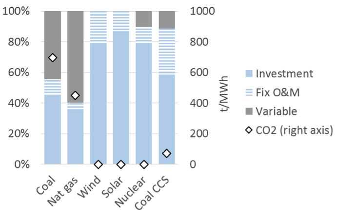
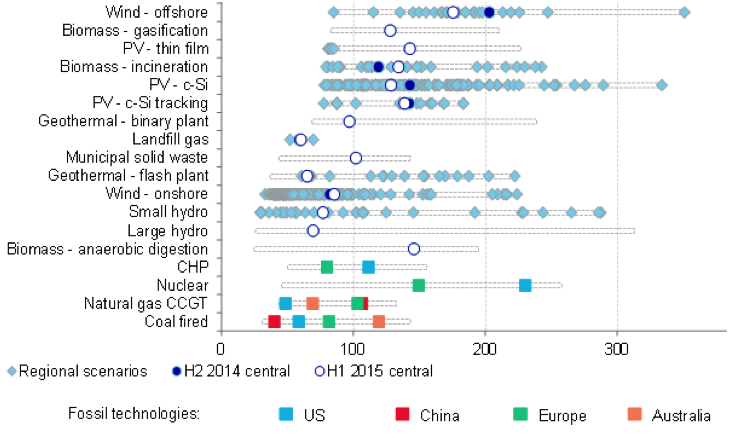
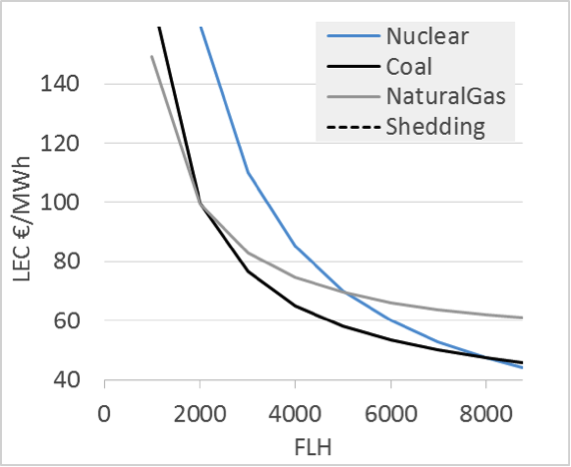
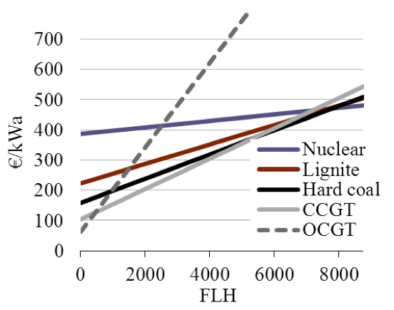

**********************************
The cost of electricity
**********************************

===================================
Learning objectives
===================================

This chapter provides an overview of the cost structure of electricity generation. After reading this chapter the reader should be able to answer:

* What kind of costs are associated with electricity generation?
* What is the difference between fixed and variable costs?
* Which metrics can be used to compare cost of generation of different power plant?
* How is the least-cost technology-mix required to fulfill electricity demand in an electrical system?

===================================
1.	Cost structure of power plants
===================================

Like other economic goods, generation of electricity requires land, labor, raw material and capital, which imply an intrinsic cost of production. For example, electricity generated using a coal-based power plant first requires the coal power plant to be built which for which an investor much bear the cost of land, equipment, construction, grid connection, financing and project management. In addition to this there are additional costs involved in running the power plant: the cost of coal that is burnt daily and expenses, including labor cost, to maintain the power plant in running condition. While the actual costs involved in electricity generation vary with the technology used, we can nevertheless build a general understanding of costs associated with electricity generation.

###############################################
1.1.	Fixed and variable costs of generation
###############################################

Broadly speaking all generation costs can be categorized into two groups depending on the point in time at which the costs are incurred: at time of the investment decision (should the power plant be built?) or at the time of the production decision (should electricity be generated using the power plant?). The costs associated with the investment decision are usually called fixed or investment costs and the costs incurred only at the time of generation are called variable or generation costs.

**Fixed costs.** These costs comprise of the cost of equipment, land, financing, project management, grid connection, and construction of the power plant and are usually expressed per unit of installed capacity (in per kW or per MW terms). Fixed costs are often regarded as “sunk costs” because once the investment decision is taken fixed costs cannot be recuperated. The plant may be sold or scrapped at some point but such a transaction usually carries a large cost. Therefore once a plant is erected and the fixed costs incurred they are called “sunk costs”.

**Variable costs.** That decision depends on the variable costs, which consist of fuel cost, operation and maintenance expenses and carbon dioxide emission charges (where applicable). They are typically calculated per unit of electricity generated (in per MWh terms). In general, fixed costs are irrelevant to production decision i.e. the decision whether to actually generate electricity using the plant at any given point in time (refer The value and price of electricity).

There is a third category between fixed and variable cost, sometimes called quasi-fixed costs, which includes cost of labor; staff can be hired or fired after the investment decision at discrete points in time but not for every single production decision. In electricity generation, such quasi-fixed costs are small enough not to merit separate treatment and are subsumed in variable cost.

**Cost structure of generation technologies.** Electricity generation technologies vary dramatically in their cost structure. Some plants, such as nuclear, wind and solar power, have virtually zero variable costs. This is in stark contrast to fossil fuel based power plants. For example, variable costs (fuel costs and emission charges) comprise approximately 40% of the levelized costs of a coal-fired power station and as much as 60% of a gas-fired combined cycle plant.

.. _my-figure3.1:

    Cost structure of different types of electricity generation technologies (illustrative, but realistic assumptions)

    Key point: Generation cost certain technologies (wind, solar, nuclear) is almost equal to the fixed costs, while in case of other technologies (coal, gas, etc.) fixed costs make up about half of the total costs.
    Source: `Hirth & Steckel (2016) <http://dx.doi.org/10.1088/1748-9326/11/11/114010>`_

In general technologies with low carbon dioxide emissions are also the ones where fixed costs make up a higher percentage of total costs. The fact that modern renewables (like wind and solar) have much lower variable costs than conventional fossil fuel power plants has problematic implications for the existing power systems and markets, which is explained in subsequent chapters on Economics of Renewable Energy.

###############################################
1.2	Annualized Fixed Costs
###############################################

Most power stations are designed to run for 20 to 60 years (‘technical lifetime’). Thus even though fixed costs are incurred at the time of investment, for analytical purposes it make sense to translate the fixed costs incurred in annualized terms i.e. calculate the cost of constructing the station per each year of its technical life. This metric is known as Annualized Fixed Costs (AFC). AFC is calculated by converting fixed costs at the time of investment into an annuity using the following formula:

.. math::
    Annualized \ Fixed \ Costs \ (AFC) &= I \times  r \times \frac{(1+r)^Y} {(1+r)^Y-1)}

where I is the investment or fixed cost in EUR per kW, r is the discount rate and Y is the technical lifetime of the power plant in years. Thus AFC depends on the actual cost of setting up a plant and its expected technical lifetime, both of which are determined to a large extent by the engineering and manufacturing processes. The discount rate on the other hand is a financial concept.

**The discount rate: weighted average cost of capital (WACC).** The most commonly used discount rate for the purpose of calculating annualized fixed costs is weighted average cost of capital or simply WACC (we use the terms WACC and cost of capital interchangeably). For investment in a power plant (or any other investment), WACC is calculated as share of equity times the cost of equity plus share of debt times the cost of debt. Cost of capital is used for discounting as it represents the “opportunity cost” of the money that is invested building the power plant: cost of equity reflects the foregone return that an investor could have earned on an alternative investment and cost of debt reflects the foregone return from leaving the money in a bank.

*Q: What is the AFC of the wind turbine in the following example?*

*Q: What is the impact of a reduction of WACC by half?*

================   ===============
Items               Wind turbine
================   ===============
Investment cost	    1000 €/kW
Discount rate	    8%
Life-time	    20 years
================   ===============

*A: EUR 101.9 per kW per year (101.9 €/kW/a)*

*A: 73.6 €/kWa, or 28% less than at a WACC of 8%.*

===========================================
2. Cost metric I: Levelized Cost
===========================================

While the distinction between fixed and variable cost of electricity is important, for various analytical and practical purposes it is often useful to compare the “average cost” of generating electricity from different power plants. Can fixed and variable costs be meaningfully combined in one metric to answer this question?

One cost metric that is frequently used for this purpose is the levelized cost of electricity (LCOE) or the levelized energy costs (LEC). This is defined as the aggregated discounted lifetime cost (fixed plus variable costs) of generating electricity per unit of output and is usually expressed in EUR per MWh. It is calculated using the following formula:

.. math::
    LCOE =  \frac {\sum_{y=1}^{Y} (1+r)^{-y} \times C_y} {\sum_{y=1}^{Y} (1+r)^{-y} \times G_y}

where G :sub:`y` is electricity generation in MWh, C :sub:`y` are aggregated fixed and variable costs for an year (in EUR per year), r is the discount rate and Y is the technical lifetime in years. The costs are called levelized because they are “leveled” over all the generation.

*Q: Calculate the levelized cost of electricity produced using a wind turbine with the following specifications. You may need to use a spreadsheet program such as MS Excel.*

===================       ================
                          Wind turbine
===================       ================
Investment cost	          1000 €/kW
Discount rate	            8%
Life-time	                20 years
Generation	              2000 MWh/MW
===================       ================

*A: 47 €/MWh.*

###########################################
2.1.	LCOE of different technologies
###########################################

It is common practice in policy and industry documents (and also in academic articles) to compare the LCOE of different technologies. A comparison of LCOE across various technologies is given in :ref:`my-figure3.2`.

.. _my-figure3.2:

    LCOE of different power generating technologies

    Source: Bloomberg New Energy Finance (2015)

LCOE is often used as a measure of cost efficiency or competitiveness of different technologies. Such analysis is indeed reasonable in case of traditional thermal power plants. Things are more complicated in case of renewable energy and such comparisons should be treated with caution. An underlying assumption of LCOE is that the output of all power plants being compared i.e. the electricity produced is identical. But this assumption may not hold when some power plants can produce electricity only at certain times of the day or year. In this case the output produced by the plants in no longer homogenous. This point is often overlooked in publications and academic literature and discussed further in chapter on “The value and price of electricity”.

**LCOE may also vary for the same technology.** For example, in regions with strong winds and low costs of capital wind energy is much cheaper than in regions with low wind speed and high WACC. In China and India, constructing coal-fired power plants is much cheaper than elsewhere because of low labor costs and economies of scale owning to the expected increase in installed capacity. In jurisdictions that price carbon and other emissions, the cost of fossil fuel based power plants is higher. As coal has to be transported over long distances, generating electricity from coal plants located near coalmines is cheaper than plants located inland.

###########################################
2.2.	What impacts LCOE?
###########################################

LCOE can obviously be calculated ex post, looking back at a power plant’s lifetime and knowing the costs that were incurred. More frequently however LCOE is calculated ex ante, before an investment decision is taken. At this time the fixed and variable costs, the generation and the discount rates (or the actual financing costs) are uncertain. Thus most LCOE calculations are necessarily based on projections and estimates.

**LCOE depends on electricity generated.** The levelized cost of electricity depends on how much electricity is generated per unit of installed capacity (MWh/MW). Generation per capacity is usually termed as *full load hours (FLH)*, where zero FLH means no electricity is generated whereas 8760 FLH means that the power plant is producing at full capacity without interruption throughout the year. For example, a power plant of 1 MW capacity would have run 8760 FLH if it generated 8760 MWh of elec-tricity during the year. Similarly, a 10 MW power plant would have run 8760 FLH if it generated 87600 MWh in a year (note that a non-leap year consists of 24 X 365 = 8760 hours). Dividing FLH achieved by a plant by 8760 yields the *“capacity factor”*: another term that is frequently used to indicate the amount of electricity generated per unit of installed capacity. A power plant that runs for 8760 FLH in a year would have a capacity factor of 100%.

Power stations are sometimes categorized as *“base load plants”*, *“mid load plants”* and *“peaking plants” (or “peakers”)* depending on the number of number of hours they run in a year or their FLH. Base load refers to power stations that operate almost around the clock almost every day of the year. Peaking plants produce electricity only during little time of the year. Mid load plants operate most days, but are turned off during nights or weekends. While, there is no uniform definition, generally base load plants have 7000 FLHs or more, mid load plants have 2000 to 7000 FLHs, and peaking plants have 2000 or less FLHs.

The FLH that a power plant runs during a year or the amount of electricity it generates is a determinant of the average cost of generating electricity from that power plant. We can restate the LCOE formula given in equation (3) as follows to see the relationship between the levelized cost of electricity and running hours:

.. math::
    LCOE &= \frac {C_fix+FLH \times C_var} {FLH}  &=  \frac {C_fix} {FLH} + C_var   

where C :sub:`fix` is the annualized fixed cost in EUR per MW, C :sub:`var` is the variable cost in EUR per MWh and FLH is full load hours in MWh per MW. It is also evident from equation (4) that higher full load hours result in a lower LCOE because the same fixed or investment costs are distributed over more units of generation. The reduction in LCOE with FLH is also higher when variables costs are relatively low. The figure below shows the relationship between FLH and LCOE for power plants based on various technologies.

.. _my-figure3.3:

    Levelized electricity costs as a function of full load hours

    Key point: Higher running hours yield lower LEC, because the same investment costs are 
    distributed over more units of output 
    Source: Own figure 

*Q: Which power station is more cost-efficient?*

==========================    ========================    ========================
Item                          Coal-fired power station	  Gas-fired power station
==========================    ========================    ========================
Fixed costs	              1630 €/kW	                  1160 €/kW
Variable costs	              30 €/MWh	                  50 €/MWh
==========================    ========================    ========================

A: It depends on the amount of energy produced or the number of FLH for which the plant is run. Total cost for generation of each unit of electricity would be equal to fixed cost plus variable cost divided by generation in MWh. In this case, the break-even point is 23,500 MWh per MW. If the power plant is expected to run less that 23,500 full load hours during its lifetime, then a gas-fired station is cheaper, otherwise the coal-fired station is cheaper. Note that this calculation ignores discounting.*

The fact that average cost of electricity decreases with running hours has important implications for the way power systems have been planned historically. Technical experts often point out FLH is determined by the technology and running conditions, including the age of the plant. They argue that nuclear or some coal-fired power plants operate as base load plants because it is technically difficult to increase or decrease generation at short notice (to ramp up or down the “cycle”), while gas plants are more flexible. This view misses the point that coal and nuclear power plants are designed to be inflexible because it is economic to do so. It is the economics that historically determined the flexibility of power plants rather than the other way around. Traditionally thermal power plants based on coal or nuclear energy were built to operate round the clock and regularly achieve a capacity factor of about 90-95 percent. These plants have relatively high fixed costs as compared to variable costs so, once they are constructed, it makes sense to run them as much as possible under almost any condition to achieve the highest FLH, and in turn, the lowest LCOE possible. On the other hand open cycle gas turbines were designed for lower FLH because high variable costs put a lower limit on the levelized costs that can be achieved. Flexibility limitations should be thought of as a consequence rather than precondition: if it is economic to almost never turn off a plant, then it does not make sense to spend much thinking in how to make it flexible!

**LCOE depends on cost of capital.** As in case of Annualized Fixed Costs, the weighted average cost of capital (WACC) of a power project is frequently used as a discount rate while calculating levelized cost. LCOE is therefore depends on WACC. If for any given power plant (or in general a type of power plant) the proportion of fixed costs in total cost is high, the LCOE for the power plant is more sensitive to changes in WACC. This implies that wind and solar power plants, which have small variable costs and high fixed costs, benefit much more from decrease in interest rates than coal or gas fired power plants. Conversely, the cost of solar and wind power plants increases more with any increase in the cost of capital (Figure 3).

**What impacts the WACC?** In general WACC is closely related to the general level of interest rates in an economy. But WACC also depends on market risks: if investors perceive an investment to be risky, for example because they fear that the investment may be expropriated or because income streams are very uncertain, they charge a higher WACC. Investors in emerging economies often face higher cost of capital, a factor that hinders the decarbonization of electrical systems. Further reading: `Hirth & Steckel (2016) <http://dx.doi.org/10.1088/1748-9326/11/11/114010>`_.

===============================================
3. Cost metric II: Screening Curves
===============================================

While LCOE has the advantage of summarizing all kinds of fixed and variable costs that occur associated with electricity generation, this brevity comes at the cost of blurring the differences between variable and fixed costs. A way of representing costs in a way that explicitly accounts for the differences between fixed and variable costs are the so-called screening curves.

**Interpreting screening curves.** Screening curves (actually, lines) depict the total cost of thermal power plants during the course of one year per unit of capacity. The x-axis shows full load hours (or capacity factors) and the y-axis shows annualized fixed costs. In Figure 5 each line represents the total cost per kW for a different thermal generation technology. The slope of the curve corresponds to the variable costs, while the intercept of a particular line corresponds to the annualized fixed cost for that technology (power plant).

.. _my-figure3.4:

    Screening curves for different thermal power plant technologies

    Key point: For different use cases (full load hours), different technologies are the least-cost options 
    Source: Own figure 

**Determining the least-cost technology.** Screening curves are a simple but powerful tool to “screen” all thermal technologies available to find out the least-cost option to generation electricity (a limitation of screening curves is that other technologies, notably hydroelectricity, wind power and solar power, cannot be sensibly depicted through them). For a given level of generation (full load hours), the lowest curve indicates the least-cost option. Take the example of Figure 5: if a power plant is meant to be used 500 hours per year or less, the least-cost option is an open cycle gas-fired power plant. If it is used more than 500 hours but less than 6000 hours, the least cost option is a combined-cycle has plant. If the station is meant to run around the clock during the entire year, the least cost option is a nuclear power plant.

We started this chapter by asking, “How is the least-cost technology-mix required to fulfill electricity demand determined in an electrical system?” It is evident that the answer depends on the cost parameters of the technologies available. But screening curves show us, that though less obvious, it is equally important to consider the use to which power plants are put. The least-cost technological choice for a power plant that is expected to operate only rarely is almost certainly different from the least-cost choice for a plant that will run around the clock.

*Q: Draw the screening curves of the following two plants.*

======================   ========================   =========================
Item	                 Coal-fired power station   Gas-fired power station
======================   ========================   =========================
Annualized fixed costs	 140 €/kW/a	            100 €/kW/a
Generation costs	       30 €/MWh	            50 €/MWh
======================   ========================   =========================

*Q: Draw the screening curves of the following five plants.*

========================   ===============================   =========================
Item	                   Annualized fixed costs (€/kW/a)     Variable costs (€/MWh)
========================   ===============================   =========================
Nuclear power	              300	                      10
Lignite-fired	              220	                      20
Coal–fired	              140	                      30
Combined cycle gas plant      100	                      50
Open cycle gas plant 	      60	                      140
========================   =============================   =========================

===========================================
4. Short term vs. long-term profitability
===========================================

One of the consequences of a differentiated cost structure of power plants is that there is much con-fusion, particularly in political debates, about profitability of the electricity sector. The confusion often results from not differentiating between short-term and long-term profits accruing to power plants. Short-term profit (sometimes called the “contribution margin”) of a power plant is calculated as the total revenue earned by a power plant minus variable costs of generation. As opposed to this long-term profit is the total discounted revenue earned by a power plant over its lifetime minus the total cost (fixed plus variable costs) incurred over the lifetime of the plant. Mathematically, long-term profit is equal to discounted sum of short-term profits minus fixed or investment cost.

**Net Present Value.** Another way of assessing long-term profitability of a power plant is by calculating the Net Present Value (NPV) of the investment. The NPV of an investment (in a power plant) is calculated using the following formula:

.. math::
   Net Present Value \ (NPV) &= \sum_{y=1}^{Y} \frac {R_y-C_y} {(1+r)^{y}} - I                                          

where R :sub:`y` is total revenue in a certain year y (in EUR), C :sub:`y` is the variable cost (in EUR), I is the total investment or fixed cost (in EUR), r is the discount rate and Y is the number of years for which the power plant is expected run.

*Q: Discuss this statement: “A nuclear power plant earns profits of 1 million Euros per day”. This statement is often heard in the political debate, sometimes to suggest that nuclear power plants earn an excessive amount of money.*

*A: The statement refers to short-term profits i.e. the revenue minus average cost of a nuclear plant is around Euro 1 million per day or about EUR 365 million per year. Taken in isolation, the statement can however be misleading, as it does not tell us anything about long-term profitability of nuclear power plants. One way to assess long-term profitability of the power plant would be to calculate net present value of the investment. Considering an initial investment of about EUR 5 billion (the rough cost of a new nuclear power plant), technical lifetime of 60 years and a discount rate of about 8%, the net present value of such an investment is equal to (-) 482 million. This implies that short-term profits of EUR 1 million per day are not sufficient to make this a profitable investment in the long-term!*
